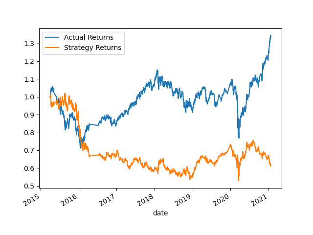
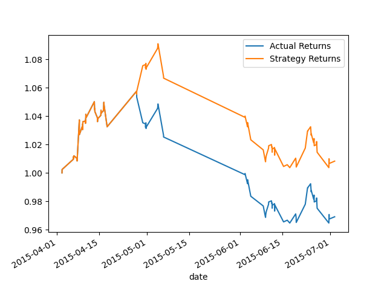
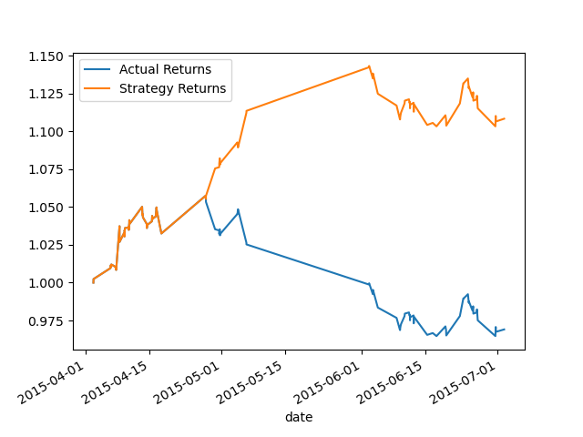

# Module-14-Challenge-Trading-Algorithm-with-Machine-Learning-Classifier
SKLearn support vector machine (SVM) AdaBoost DecisionTreeClassifier or LogisticRegression
#### strategy returns on Baseline Perfornace

#### actual returns vs. the strategy returns

#### actual returns versus the strategy returns with Backtest the new model

