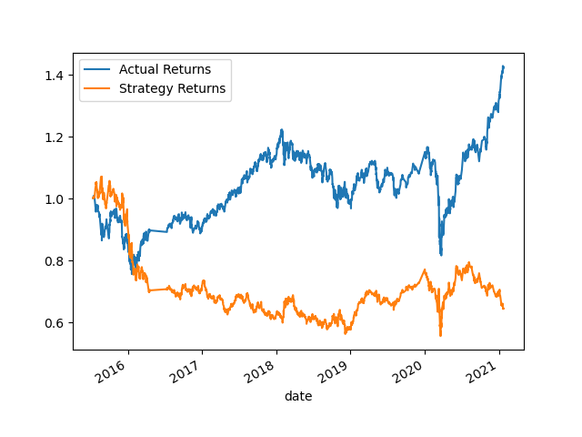
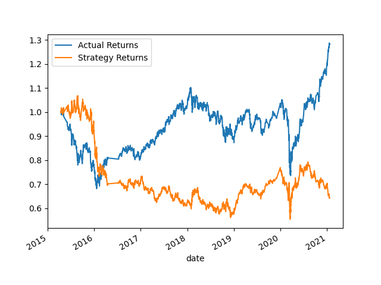

# Module-14-Challenge-Trading-Algorithm-with-Machine-Learning-Classifier
SKLearn support vector machine (SVM) AdaBoost DecisionTreeClassifier or LogisticRegression
#### Strategy returns on Baseline Perfornace with short_window = 4 and long_window = 100 

#### Strategy returns on Baseline Perfornace with short_window = 2 and long_window = 50 

By decreasing the SMA window to 2 and 500 the actual return drops. Increasing both the SAM window the actual return improved.  

#### actual returns vs. the strategy returns 3 months traning period of dataset

#### actual returns vs. the strategy returns 9 months traning period of dataset

By increasing the training window with an offset of 9 months both the returns dropped. 

#### actual returns versus the strategy returns with Backtest the new model

Yes this new model perform better that the provided baseline model where the strategy returns are higher. 

The trading algorithm performed better compared to the baseline model. 

